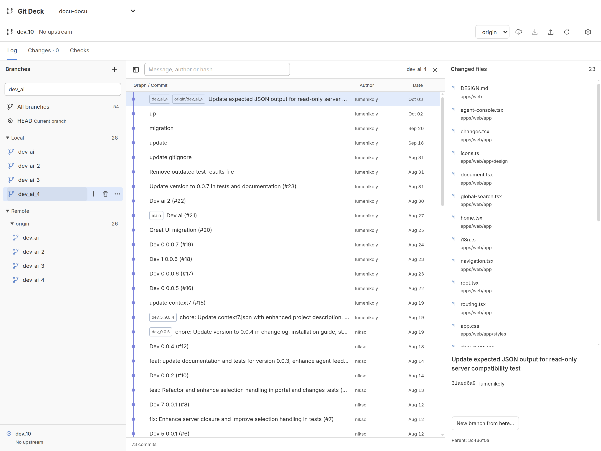
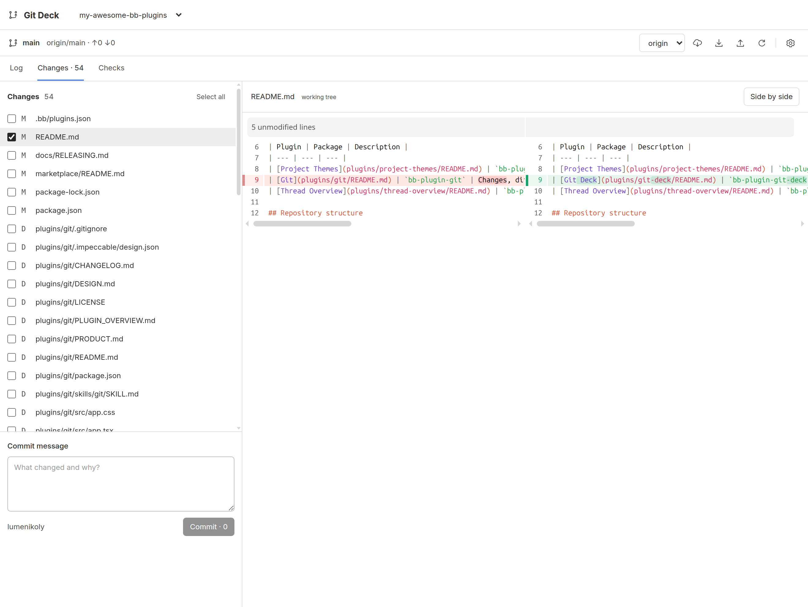
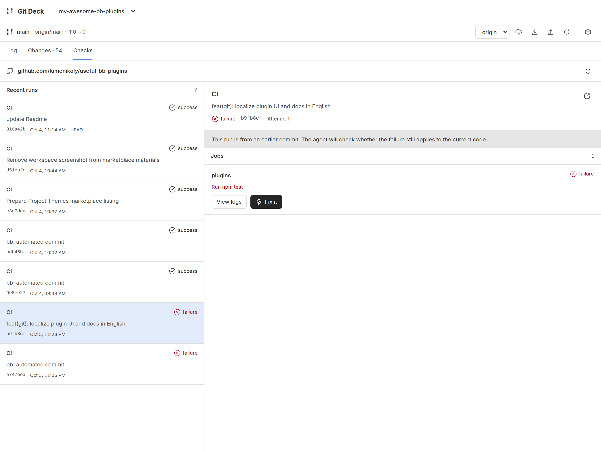

# Git Deck 0.1.0 — publication preview

Prepared for review. The release tag and marketplace PR are not published.

## Marketplace card

**Git Deck** · Code & Reviews · lumenikoly · `GitBranch` icon

Review branches and changes, commit your work, and sync repositories without leaving BB. Browse commit graphs and diffs, with separate author and SSH settings for each repository. Inspect failed GitHub Actions and prepare a Fix it request for an agent to review. Requires Git and OpenSSH on Linux or macOS; GitHub checks additionally require GitHub CLI and a GitHub account.

## Release identity

- ID: `git-deck`
- Package: `bb-plugin-git-deck@0.1.0`
- Repository: https://github.com/lumenikoly/useful-bb-plugins
- Directory: `plugins/git-deck`
- Tag: `git-deck-v0.1.0`
- Tracking range: `^0.1.0`, prefix `git-deck-`

## Screenshots

Only the plugin surface is captured. Thread lists and BB navigation are outside the frame. Local paths and email addresses are hidden.

### Log

### Changes

### Checks

## Full marketplace overview

## Branches, history and changes

Git Deck opens as a dedicated BB page or a thread panel. Browse local and remote
branches, star favorites and inspect a commit graph alongside changed files and
diffs. Selecting a branch browses its history; checking it out is a separate
action. Create branches from another branch or a commit, set up remote tracking,
rename branches, delete merged local branches, and compare branch tips. Compact
row actions let you create from a branch or confirm a local deletion directly;
the creation dialog also lets you choose the source branch.

Stage selected files, review side-by-side or unified diffs, and commit the current
index. Fetch, Push and fast-forward-only Pull use standard Git on the checkout's
host. Fetch and Pull prune stale remote-tracking branches. Merge a branch into
the current branch, resolve conflicts in your editor,
then complete or abort the merge from the panel. Git hooks and signing settings
continue to apply.

## Accounts and system SSH

Set an author name, email and optional SSH command per repository. Settings are
stored in local Git config and shared across that repository's worktrees. Empty
fields restore inherited configuration. Use your existing system SSH config,
host aliases, keys, ssh-agent and credential helpers on the selected checkout's
host. Passwords, key passphrases and new host-key confirmations appear in BB
when Git or SSH requests them; the plugin does not save these responses.

SSH commands apply to SSH remotes. HTTPS remotes continue to use HTTPS
credentials. The panel shows a separate push URL when one is configured.

## GitHub Actions and Fix it

With GitHub CLI installed and authenticated on the checkout's host, Checks shows
the latest 30 workflow runs for the current branch. Inspect failed jobs, steps
and logs, then choose Fix it to prepare a diagnostic request in BB's native
composer. The project and worktree selection are seeded; review the workspace,
choose an agent and send the request yourself. A thread panel can append it to
the current chat when that chat uses the selected checkout.

Choose a stored gh account for each repository without changing gh's globally
active account. API tokens stay on the host. System SSH aliases and authenticated
GitHub Enterprise hosts are supported.

Fix requests include the failed and current commits, workflow attempt and bounded
logs. The current branch must contain the failed commit; changed checkouts and
rerun attempts require refreshing. Fix it does not send, commit, push or rerun
workflows automatically.

## Requirements and limits

Requires BB 0.45+, Plugin SDK 0.6.15+, Node.js 22.18+, Git and OpenSSH on a Linux
or macOS checkout host. GitHub Actions features additionally require GitHub CLI
and a GitHub account with access to the repository. Basic Git workflows work
without GitHub CLI.

History loads in batches of 100, up to 1,000 commits. Search covers loaded history.
Graph lines represent actual commit parents; a squash merge has no merge edge.
Fix logs are capped at a 96,000-character tail. This release shows GitHub Actions;
third-party CI checks and advanced Git operations remain outside the panel.
